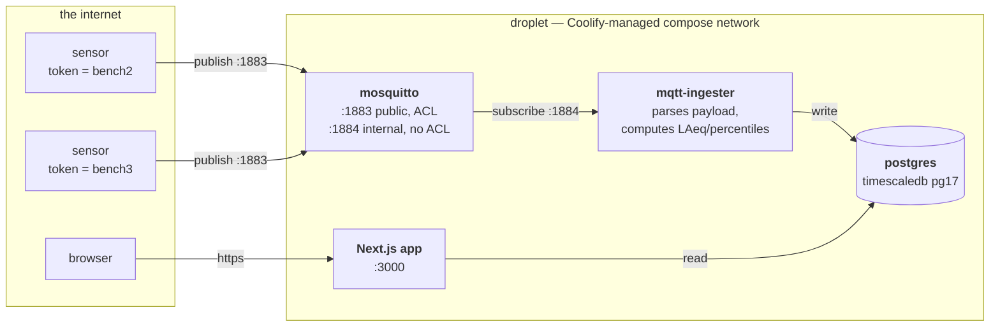
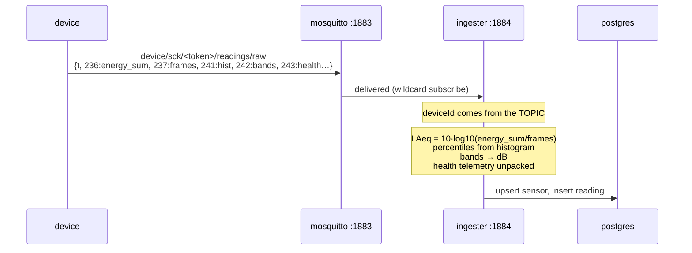
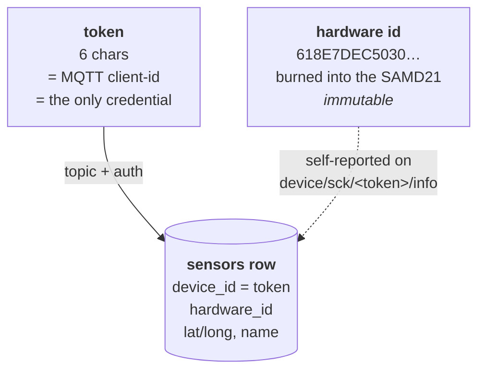

# Backend infrastructure

What runs where, what is exposed, and how a sound measurement gets from a sensor
to the database. Current as of 2026-08-02, after the prod cutover.

Companion docs: `architecture-current.md` (system overview),
firmware repo `docs/soundwatch/provisioning-and-identity.md` (how devices are
provisioned and identified).

## Deployment topology

Everything runs on one DigitalOcean droplet (`188.166.164.198`, 2 vCPU / 2 GB),
managed by **Coolify**, which deploys `schemalabz/soundwatch` branch `main` via
docker-compose. Pushing to `main` triggers a rebuild.



**Only two ports are published to the host: `3000` (app) and `1883` (devices).**
Postgres and listener 1884 are reachable only from inside the compose network.

## The two MQTT listeners — and why

This is the security model, so it is worth understanding rather than copying.

| | 1883 | 1884 |
|---|---|---|
| Exposed to internet | **yes** | **no** — not in any `ports:` |
| Anonymous | yes | yes |
| ACL | **`pattern readwrite device/sck/%c/#`** | none |
| Who uses it | sensors | ingester and any backend service |

**Why devices are confined.** The firmware sends no username/password — the MQTT
**client-id is the token**. `%c` expands to that client-id, so a device can only
read and write its own subtree. A leaked token exposes exactly one device: it
cannot read another unit's data, forge readings in its name, or reach another
unit's `cmd` topic (which triggers remote config and OTA).

**Why a second listener exists.** The ingester must subscribe to
`device/sck/+/readings/raw` — a wildcard across every device — which the device
ACL correctly forbids. Rather than issue and rotate broker credentials for
backend services, they get a listener with no route from outside. **The
protection is network-level, not auth-level** — exactly how postgres is already
protected.

> ⚠️ **Never add 1884 to a `ports:` section.** One line would grant the internet
> unrestricted read/write across every device topic, including OTA commands.
> Nothing in the config prevents this; it is a convention you have to keep.

**This was observed working.** During the cutover an ingester on 1883 and one on
1884 ran simultaneously for ~90 s: the 1883 one stored **0** readings (wildcard
denied), the 1884 one stored **2**. No duplicates, no gap.

TLS (8883) was removed. The ESP8266 firmware uses a plain `WiFiClient`, so no
device could ever use it — it was theatre while 1883 sat open. Reinstate it when
the firmware can speak TLS. **Traffic today is unencrypted: this is containment,
not confidentiality.**

## How a reading becomes a row



The device sends **raw integer accumulators**; every logarithm and statistic is
computed server-side. That is deliberate: energies are additive, so intervals can
be merged losslessly, and any new metric can be re-derived from stored rows
without touching firmware.

## What is stored per reading

| group | columns |
|---|---|
| identity / time | `sensor_id`, `recorded_at` (device clock), `received_at` (server clock — distinguishes replayed backlog from live data) |
| raw accumulators | `energy_sum`, `frame_count`, `interval_s`, `max_energy`, `min_energy`, `payload_version` |
| computed levels | `laeq`, `realized_duty`, `lmax_est`, `lmin_est` |
| spectrum | `hist_raw`, `bands_raw` (verbatim, for reprocessing) · `l10`, `l50`, `l90` · `bands_db` (21 values) |
| **device health** | `device_uptime_s`, `free_heap_bytes`, `reset_cause`, `wifi_connects`, `publish_fails`, `capture_fails` |
| environment | temperature, humidity, pressure, light, UV, PM, battery, RSSI, SD |

**On `reset_cause`:** 32 = watchdog. 64 = "SYST", which covers **both** a software
reset and a power cycle, because the UF2 bootloader resets before the app runs.
64 cannot distinguish "lost power" from "reset itself".

## Identity



The token is **simultaneously the name, the address and the password**. The
hardware id is reported by the device and stored so you can answer "which
physical box is this?" and detect units swapped during installation.

**Note:** `device/inventory` carries the hardware id but **no token**, so it is
unattributable. Only `device/sck/<token>/info` — where the topic carries the
token — can link the two.

### Known limitations at scale

- **Sensors are auto-created.** Any token that publishes gets a row, so a typo at
  provisioning silently creates a phantom sensor.
- **Rotating a token orphans history**, because `device_id` *is* the identity.
- **6-character tokens** (`char token[7]`) are the sole credential.
- **No installation history** — a unit moved between locations leaves no record.

Direction of travel: physical device (hardware id) / credential (token, rotatable)
/ installation (device at location over a date range) as three separate things.

## Operational notes

- **Migrations run automatically** — the ingester applies `prisma migrate deploy`
  before starting, so a deploy converges the schema and a fresh volume rebuilds
  from zero.
- **Deploying = pushing to `main`.** A GitHub webhook triggers Coolify.
- **Devices buffer and replay.** If the broker is unreachable a device stores
  readings to flash and replays on reconnect — so `received_at` can be far later
  than `recorded_at`.
- **Two stacks share this droplet.** Production is the Coolify resource
  `soundwatch`; staging is `staging-soundwatch-app`. Both run a container named
  `postgres-*`, so **anything that selects "the postgres container" by name is
  wrong**. Select on the `coolify.resourceName` label. `scripts/prod-sql.sh
  --containers` lists what is there.
- **Disk: 154 GB, ~60 % used** (checked 2026-09-16). Most of the usage is the
  backup directory.
- **Nightly DB backups** — 03:15 UTC via `/etc/cron.d/soundwatch-db-backup`,
  which runs `/root/db-backup.sh` (installed by `scripts/prod-backup.sh
  install`; editing the repo script changes nothing until you re-run `install`).
  `-Fc` dumps into `/root/db-backups`, 14-day rotation, one line per run in
  `backup.log`. That line now records the resource and its row counts —
  `OK 261M … [soundwatch: 24 sensors / 634254 readings]` — so a dump of the
  wrong database is visible as wrong numbers, not just an odd file size. The
  script refuses to run unless exactly one container carries the expected label.
  Dumps stay on the droplet: run `scripts/prod-backup.sh fetch` periodically.
- **Tokens are minted server-side** in the admin provisioning flow (16-char);
  `onboard.sh` registers every unit with the backend before flashing.

### Restoring a backup

Verified end-to-end on 2026-09-16: a production dump restored into a scratch
database matched the source exactly — 634,155 readings, 24 sensors, 1 hypertable,
14 chunks, 1 continuous aggregate.

```sh
createdb restored
psql -d restored -c 'CREATE EXTENSION IF NOT EXISTS timescaledb'
psql -d restored -c 'SELECT timescaledb_pre_restore()'
pg_restore -d restored --no-owner <dump>
psql -d restored -c 'SELECT timescaledb_post_restore()'
```

The `pre_restore`/`post_restore` calls are **required**. `pg_dump` warns about
circular foreign keys on TimescaleDB's `continuous_agg` catalog; a plain
`pg_restore` leaves the hypertable and the aggregate broken. Restore into a
scratch database first — never straight over a live one.

## Not yet built

- Alerting when a device goes silent (`last_seen_at` exists; nothing watches it)
- **Backup verification in the job.** The restore above was done by hand. Nothing
  checks that last night's dump is restorable.
- **Off-droplet backups are manual.** `fetch` is a command someone has to
  remember; before 2026-09-16 the newest local copy was six weeks old. DO droplet
  Backups or an object-store push would remove the human.
- Frame-log retention — nothing expires `frame_log_chunks`
- `laeq` named as `laeq` in the UI (currently surfaced under the legacy
  `noiseDba` key so existing views keep working)
