# Signal pipeline: mic → DSP → MQTT → Postgres → classify

The end-to-end path a sound takes, from the Smart Citizen Kit (SCK) microphone to a
classified source in the backend. The on-device DSP block (record → DC removal → window →
FFT → bands/dBA) is exactly what `minimal_bands.py` emulates and what the
[acoustic classifier](acoustic-classifier.md) reprocesses; the tail (publish → broker →
ingester → Postgres → classify) is the live [mosquitto → ingester → Postgres pipeline](research/smart-citizen-kit.md)
that will eventually replace the synthetic timing in the [dashboard mock](reproduce-mock-data.md).

Two branches split after equalization: an **A-weighted** branch producing the single
`dBA` loudness number, and an **un-weighted** branch producing the **7 firmware bands**
(deliberately not A-weighted, so low-frequency energy survives for truck-vs-motor
discrimination).

```mermaid
flowchart TD
    A["🎙️ Record from mic<br/>24-bit, 44100 Hz<br/>512 samples (~11.6 ms)"] --> B
    B["Buffer the 512 samples<br/>e.g. 1003, 1050, 995, 1012 …<br/>(hover around ~1000)"] --> C
    C["DC removal<br/>subtract the average (~1000)<br/>→ +3, +50, −5, +12 … (centered on 0)<br/><i>removes silent offset</i>"] --> D
    D["Scale + Window (Hann)<br/>shrink 24-bit → 16-bit for FFT;<br/>fade edges to 0<br/><i>prevents overflow & fake frequencies</i>"] --> E
    E["FFT → 256 magnitude bins<br/>each ~86 Hz wide<br/>bin0≈0 Hz, bin1≈86, bin2≈172 …<br/><i>fixed: always 512/2 = 256</i>"] --> EQ
    EQ["Equalize<br/><i>undo mic's own coloring</i>"] --> W

    W{"weighting?"}
    W -->|"A-weight branch<br/>(dBA capture)"| F
    W -->|"un-weighted branch<br/>(bands capture)"| BND

    F["+ A-weight<br/>×human-hearing curve<br/>63Hz×0.09, 1kHz×1.0, 4kHz×1.15"] --> G
    G["RMS across all 256 bins<br/>square → average → √<br/>→ one energy number<br/>e.g. rms = 0.0025"] --> H
    H["Convert to dB SPL<br/>120 − (144.5 − 20·log10(rms·√2))<br/>→ ~65 dBA"] --> I
    I["💾 NOISE_A = 65 dBA"]

    BND["Split 256 bins into 7 groups<br/><i>no human-hearing curve →<br/>keeps bass for truck vs motor</i>"] --> BRMS
    BRMS["Per group: RMS → dB SPL<br/><b>LOW</b> &lt;250 · <b>250</b> · <b>500</b> · <b>1k</b> · <b>2k</b> · <b>4k</b> · <b>8k</b> Hz<br/>bins 1-2 · 3-4 · 5-8 · 9-16 · 17-33 · 34-66 · 67-131"] --> BPUB
    BPUB["💾 NOISE_LOW, 250, 500, 1K, 2K, 4K, 8K<br/>(7 dB numbers, ids 228–234)"]

    %% ---- connectivity + security ----
    I --> PUB
    BPUB --> PUB
    PUB["📡 SCK publishes MQTT payload<br/>{t, 53:dBA, 228–234:bands}<br/>topic device/sck/&lt;token&gt;/readings/raw"]
    PUB -->|"🔒 token + credential · port 1883"| MOSQ
    MOSQ["🦟 mosquitto broker<br/>🔒 authenticate device vs Postgres<br/>🔒 ACL: only its own device/sck/&lt;token&gt;/#"] --> ING
    ING["⚙️ mqtt-ingester<br/>parse payload · map ids → columns"] --> PG
    PG["🗄️ Postgres<br/>readings + 7 band columns"] --> CLS
    CLS["🖥️ Backend classify (per 1 s series)<br/>tilt = LOW − HIGH + duration<br/>→ truck (bass, sustained) vs motor (bright, brief)"]

    style A fill:#E6F1FB,stroke:#185FA5
    style I fill:#EAF3DE,stroke:#3B6D11
    style BPUB fill:#EAF3DE,stroke:#3B6D11
    style F fill:#FAEEDA,stroke:#854F0B
    style H fill:#FAEEDA,stroke:#854F0B
    style BND fill:#FAEEDA,stroke:#854F0B
    style PUB fill:#E6F1FB,stroke:#185FA5
    style MOSQ fill:#EEEDFE,stroke:#534AB7
    style ING fill:#E6F1FB,stroke:#185FA5
    style PG fill:#EAF3DE,stroke:#3B6D11
    style CLS fill:#EAF3DE,stroke:#3B6D11
```

## How this maps to the code

| Diagram stage | Where it lives |
|---|---|
| Record → DC removal → window → FFT → equalize | `minimal_bands.py` (`buffer_frames`, `dc_removal`, `scale_and_window`, `fft_magnitudes`) — shared by `scripts/soundbands/` and `scripts/acoustic-classifier/` |
| A-weight branch → `NOISE_A` (dBA) | `dba_capture()` |
| Un-weighted branch → 7 bands | `bands_capture()` — the `LOW·250·500·1K·2K·4K·8K` split |
| Publish → broker → ingester → Postgres | `mqtt-ingester/`, `mosquitto/`, `prisma/` schema |
| Backend classify | the [4-label classifier](acoustic-classifier.md) — in the diagram the backend does a coarse tilt/duration heuristic; the classifier repo shows that per-band **temporal** features (onset rate, modulation, crest) are what actually lift accuracy |

> The bin→band mapping shown (bins `1-2 · 3-4 · 5-8 · 9-16 · 17-33 · 34-66 · 67-131`) is
> Config **A** — the firmware baseline. The classifier's ablation asks what a longer FFT,
> more bands, or temporal statistics would add on top of it.
